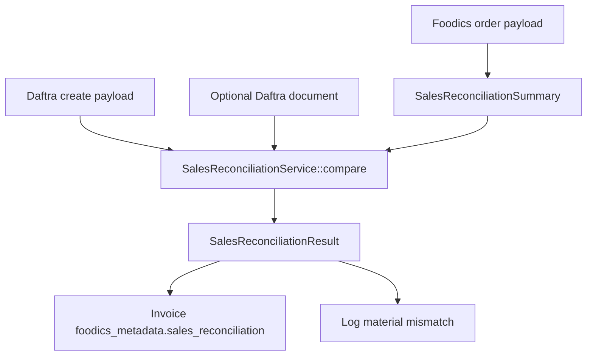

# 035 - Sales Reconciliation and Amount Accuracy

## Overview

Add an order-level reconciliation layer that proves the Foodics sales amounts represented in the current sync pipeline match the accounting amounts sent to, and later read from, Daftra.

This spec follows `spec/034-accounting-erp-guide-gap-analysis.md`. It keeps the product sales-first and focuses on accounting accuracy before expanding into inventory or house-account sync.

## Problem

The current sync pipeline already creates Daftra invoices for completed Foodics orders and Daftra credit notes for returned Foodics orders. It also supports products, modifier options, combo child products, charges, taxes, discounts, payments, and returns.

The remaining risk is amount drift:

- Foodics exposes totals and nested amount paths that must reconcile together.
- Daftra recalculates invoice totals from submitted lines, taxes, discounts, and payments.
- Tips, rounding, combo wrapper discounts, combo product options, returned-order payments, and tax inclusivity can create small or material differences if not represented consistently.

The goal is not to change sync behavior blindly. First, capture enough reconciliation data to identify where drift exists and which follow-up implementation is needed.

## Foodics Guide Inputs

The reconciliation should use the Accounting/ERP guide's sales fields:

| Category | Foodics path |
| --- | --- |
| Product taxes | `products.taxes.*.pivot.amount` |
| Product option taxes | `products.options.*.taxes.*.pivot.amount` |
| Charge taxes | `charges.*.taxes.*.pivot.amount` |
| Combo product taxes | `combos.*.products.*.taxes.*.pivot.amount` |
| Combo product option taxes | `combos.*.products.*.options.*.taxes.*.pivot.amount` |
| Charges | `charges.*.charge.value` and `charges.*.amount` |
| Product discounts | `products.*.discount_amount` |
| Product option discounts | `products.*.options.*.discount_amount` or `tax_exclusive_discount_amount` |
| Combo discounts | `combos.*.discount_amount` and child product discounts |
| Order discount | `discount_amount` |
| Subtotal | `subtotal_price` |
| Rounding | `rounding_amount` |
| Total | `total_price` |
| Tips | `payments.*.tips` |
| Payments | `payments.*.amount` |

## Decisions

| Concern | Decision |
| --- | --- |
| First deliverable | Build reconciliation reporting and tests before changing invoice math |
| Scope | Completed orders and returned orders only |
| Source of truth | Foodics order payload is the expected accounting source; Daftra payload/result is compared against it |
| Tolerance | Allow normal decimal rounding differences, defaulting to `0.01` per component and total |
| Sign handling | Completed orders are positive; returned orders are represented as positive credit-note lines but reconciled as negative net sales |
| Persistence | Store reconciliation output on the local `invoices` row metadata unless implementation finds a cleaner existing diagnostics field |
| Operator visibility | Surface material drift in a way the invoices page or dashboard can later expose |
| External calls | Do not add new Foodics endpoints in this spec except where existing order payloads already contain the needed data |
| Inventory and house accounts | Out of scope |

## Proposed Design

Create a small reconciliation service that can produce a normalized summary from a Foodics order and compare it to the local/Daftra sync representation.

Use the existing `app/Dtos` area for immutable reconciliation data objects and add one enum for result classification. Do not add database columns in the first implementation; persist the serialized result in invoice metadata.

Create:

- `App\Enums\SalesReconciliationStatus`
  - `Ok = 'ok'`
  - `RoundingOnly = 'rounding_only'`
  - `KnownGap = 'known_gap'`
  - `Mismatch = 'mismatch'`
- `App\Dtos\Reconciliation\SalesReconciliationDifference`
- `App\Dtos\Reconciliation\SalesReconciliationSummary`
- `App\Dtos\Reconciliation\SalesReconciliationResult`
- `App\Services\Reconciliation\SalesReconciliationService`

Keep DTOs as plain `readonly` PHP classes with constructor property promotion and `toArray()` methods. Do not rely on the currently empty `Spatie\LaravelData` DTO pattern unless the implementation first establishes that pattern elsewhere.

Service API:

```php
namespace App\Services\Reconciliation;

class SalesReconciliationService
{
    public function summarizeFoodicsOrder(array $order): SalesReconciliationSummary;

    public function compare(array $order, array $daftraPayload, ?array $daftraDocument = null): SalesReconciliationResult;
}
```

### Data Flow



### Summary Shape

The summary should include:

- `subtotal`
- `product_total`
- `option_total`
- `combo_product_total`
- `charge_total`
- `product_discount_total`
- `option_discount_total`
- `combo_discount_total`
- `order_discount`
- `tax_total`
- `tip_total`
- `rounding_amount`
- `payment_total`
- `expected_total`
- `status`
- `type` (`invoice` or `credit_note`)
- `differences`

The result should include:

- `status`
- `summary`
- `differences`
- `tolerance`
- `checked_at`

## Calculation Rules

### Product Lines

- Sum normal product line totals from `products.*.total_price`.
- Sum normal product line discounts from `products.*.discount_amount`.
- Sum normal product taxes from `products.*.taxes.*.pivot.amount`.
- Include modifier option totals from `products.*.options.*.total_price`.
- Include modifier option discounts from `discount_amount` or `tax_exclusive_discount_amount`.
- Include modifier option taxes from `products.*.options.*.taxes.*.pivot.amount`.

### Combo Lines

- Sum combo child product totals from `combos.*.products.*.total_price`.
- Sum combo child product discounts from `combos.*.products.*.discount_amount`.
- Sum combo child product taxes from `combos.*.products.*.taxes.*.pivot.amount`.
- Record combo product option totals/taxes separately, because the current sync intentionally ignores combo product options.
- Record combo wrapper discounts separately, because the current sync intentionally does not create a wrapper discount line.

### Charges

- Sum charges from `charges.*.amount`.
- Sum charge taxes from `charges.*.taxes.*.pivot.amount`.

### Payments, Tips, and Rounding

- Sum payment amounts from `payments.*.amount`.
- Sum tips from `payments.*.tips`.
- Preserve `rounding_amount` separately.
- Reconciliation should flag whether tips and rounding are included in the Daftra representation or remain unexplained differences.

### Returns

- For Foodics status `5`, produce a credit-note reconciliation result.
- Keep line components positive for Daftra payload comparison.
- Also expose a signed net-sales value that deducts the return from completed sales.
- If a return includes payments, flag them as currently unsupported until a credit-note payment behavior is implemented.

## Differences

A reconciliation result should distinguish:

- `ok` - no material drift.
- `rounding_only` - only tolerance-level differences exist.
- `known_gap` - drift is explained by a currently deferred feature, such as tips, rounding, combo options, combo wrapper discounts, or return payments.
- `mismatch` - drift is not explained and needs investigation.

Each difference should include:

- Component name.
- Foodics amount.
- Daftra amount when available.
- Delta.
- Severity.
- Explanation.

## Comparison Rules

Compare against the Daftra create payload first. Use the optional Daftra document only for fields returned after creation, such as id, number, or client id. Do not require Daftra to return full line item details in this first implementation.

Initial comparisons:

- Foodics `total_price` against the derived Daftra invoice or credit-note line total after line discounts and order discount.
- Foodics `payments.*.amount` against created invoice payment payload totals when available.
- Tips, rounding, combo product options, combo wrapper discounts, and return payments as explicit known-gap components.

Classification rules:

- `ok` when there are no material differences and no known-gap amounts.
- `rounding_only` when all differences are within the configured tolerance.
- `known_gap` when every material difference is explained by a deferred component.
- `mismatch` when any material unexplained difference remains.

Default tolerance is `0.01`.

## Sync Integration Plan

The sync services currently build Daftra payloads inside resolver methods that return only Daftra ids. Reconciliation needs the exact submitted payload, so first extract payload builders without changing behavior.

### Completed Orders

In `app/Services/SyncOrder.php`:

- Extract `buildDaftraInvoicePayload(array $order): array` from the current payload construction inside `resolveDaftraInvoiceId()`.
- Keep existing product, tax, payment-method, client, and default-client resolution behavior unchanged.
- Use the extracted payload for `InvoiceService::createInvoice()`.
- Run reconciliation in `runSync()` after the Daftra invoice id is known and before marking the local row as `Synced`.
- Merge reconciliation output into `foodics_metadata['sales_reconciliation']`.
- Preserve existing `daftra_metadata['client_id']` when adding or updating Daftra metadata.

### Returned Orders

In `app/Services/SyncCreditNote.php`:

- Extract `buildDaftraCreditNotePayload(array $order, Invoice $original): array` from the current payload construction inside `resolveDaftraCreditNoteId()`.
- Keep existing original-invoice lookup, client fallback, credit-note id reuse, and warning for return payments unchanged.
- Use the extracted payload for `InvoiceService::createCreditNote()`.
- Run reconciliation after the Daftra credit-note id is known and before marking the local row as `Synced`.
- Merge reconciliation output into `foodics_metadata['sales_reconciliation']`.

### Existing Daftra Documents

For retries or rows that already have a Daftra id, rebuild the comparable payload from the current Foodics order only after normal prerequisite resolution has run. Do not add new Foodics calls.

## Persistence and Logging

Persist reconciliation output under:

```php
$invoice->foodics_metadata['sales_reconciliation']
```

The serialized result should include:

- `status`
- `summary`
- `differences`
- `tolerance`
- `checked_at`

When updating metadata:

- Merge into existing `foodics_metadata`; do not overwrite unrelated keys.
- Merge `daftra_metadata`; do not remove `client_id`, because credit-note client fallback depends on it.
- Do not throw on reconciliation drift.
- Log `warning` only for `mismatch`, including `order_id`, `invoice_id`, `invoice_type`, `status`, and differences.
- If reconciliation code itself throws unexpectedly after Daftra sync succeeded, log the exception and allow the sync to continue.

## Files to Create

1. `app/Enums/SalesReconciliationStatus.php`
2. `app/Dtos/Reconciliation/SalesReconciliationDifference.php`
3. `app/Dtos/Reconciliation/SalesReconciliationSummary.php`
4. `app/Dtos/Reconciliation/SalesReconciliationResult.php`
5. `app/Services/Reconciliation/SalesReconciliationService.php`
6. `tests/Unit/Services/Reconciliation/SalesReconciliationServiceTest.php`
7. `tests/Feature/Services/SyncOrderReconciliationTest.php`
8. `tests/Feature/Services/SyncOrderReturnReconciliationTest.php`

## Files to Modify

Likely candidates:

1. `app/Services/SyncOrder.php` - run reconciliation after creating the Daftra invoice payload and persist the result.
2. `app/Services/SyncCreditNote.php` - run reconciliation after creating the Daftra credit-note payload and persist the result.
3. Existing exact metadata assertions in sync tests that currently expect `foodics_metadata` to be `[]`.
4. `app/Models/Invoice.php` only if a tiny metadata helper meaningfully reduces duplication.
5. `database/factories/InvoiceFactory.php` only if tests need default reconciliation metadata.

## Tests

Use Pest.

### Foodics Summary Tests

- It summarizes a simple completed order with one product and one payment.
- It summarizes product taxes from `products.taxes.*.pivot.amount`.
- It summarizes modifier option totals and taxes.
- It summarizes charges and charge taxes.
- It summarizes order-level discounts.
- It summarizes payment tips.
- It preserves rounding amount.
- It summarizes a combo order with child products.
- It records combo product options as a known gap.
- It records combo wrapper discounts as a known gap.
- It summarizes a returned order as a credit-note reconciliation.
- It records returned-order payments as a known gap.
- It handles missing nullable arrays as empty collections.

### Comparison Tests

- It returns `ok` when Foodics and Daftra amounts match.
- It returns `rounding_only` when differences are within tolerance.
- It returns `known_gap` for tips not represented on the Daftra payload.
- It returns `known_gap` for rounding not represented on the Daftra payload.
- It returns `known_gap` for combo option amounts ignored by the current sync.
- It returns `mismatch` for unexplained total drift.
- It includes component-level deltas in the result.

### Sync Integration Tests

- Completed order sync stores reconciliation metadata on the local invoice row.
- Returned order sync stores reconciliation metadata on the local credit-note row.
- Failed reconciliation does not prevent invoice sync unless the actual Daftra sync fails.
- Material drift is logged with the Foodics order id and local invoice id.

Follow existing Pest patterns from `tests/Feature/Services/SyncOrderTest.php` and `tests/Feature/Services/SyncOrderReturnTest.php`:

- Use `RefreshDatabase`.
- Create a user with `User::factory()->create()`.
- Set user context with `Context::add('user', $user)`.
- Mock `DaftraApiClient` with `Mockery::mock()`.
- Bind mocks with `$this->app->instance(...)`.
- Use the shared `mockHttpResponse()` helper from `tests/Pest.php`.
- Use small inline order arrays for unit tests and existing JSON stubs only for larger sync-shape coverage.

## Acceptance Criteria

1. The app can produce a normalized Foodics sales summary for completed and returned orders.
2. The app can compare Foodics expected amounts against Daftra invoice or credit-note representation.
3. Tips, rounding, combo product options, combo wrapper discounts, and returned-order payments are identified as known gaps instead of silent drift.
4. Material unexplained drift is visible in logs and persisted metadata.
5. Existing invoice and credit-note sync behavior remains unchanged unless a test proves a reconciliation-safe adjustment is needed.
6. Focused Pest tests cover happy paths, nullable/missing fields, known gaps, rounding tolerance, and returned orders.

## Implementation Order

1. Add `SalesReconciliationStatus`.
2. Add reconciliation DTOs with `toArray()` methods.
3. Add `SalesReconciliationService::summarizeFoodicsOrder()` and unit tests for products, options, combos, charges, discounts, taxes, payments, tips, rounding, nullable/missing arrays, and returns.
4. Add `SalesReconciliationService::compare()` and unit tests for `ok`, `rounding_only`, `known_gap`, and `mismatch`.
5. Extract `buildDaftraInvoicePayload()` from `SyncOrder` without changing the existing create-invoice payload.
6. Extract `buildDaftraCreditNotePayload()` from `SyncCreditNote` without changing the existing create-credit-note payload.
7. Inject `SalesReconciliationService` into `SyncOrder` and persist reconciliation metadata for completed invoices.
8. Inject `SalesReconciliationService` into `SyncCreditNote` and persist reconciliation metadata for credit notes.
9. Add warning logs for `mismatch` only.
10. Add feature tests for completed invoice metadata persistence, credit-note metadata persistence, return-payment known gaps, and non-blocking mismatch logging.
11. Update existing exact metadata assertions that currently expect `foodics_metadata` to be empty.
12. Run focused tests and `vendor/bin/pint --dirty --format agent`.

## Verification Commands

Run:

```bash
php artisan test --compact tests/Unit/Services/Reconciliation/SalesReconciliationServiceTest.php
php artisan test --compact tests/Feature/Services/SyncOrderReconciliationTest.php
php artisan test --compact tests/Feature/Services/SyncOrderReturnReconciliationTest.php
php artisan test --compact tests/Feature/Services/SyncOrderTest.php tests/Feature/Services/SyncOrderReturnTest.php tests/Feature/Services/SyncOrderTaxTest.php
vendor/bin/pint --dirty --format agent
```

If these pass, ask before running the full suite.

## Risks and Guardrails

- Do not overwrite `foodics_metadata` or `daftra_metadata`; merge new keys.
- Do not change invoice or credit-note line item math in this feature.
- Do not add inventory, house-account, Foodics `/settings`, or UI work.
- Do not add database columns until filtering or sorting by reconciliation status is needed.
- Keep known gaps explicit so they can become follow-up specs instead of hidden mismatches.

## Out of Scope

- Implementing Foodics `/settings`; covered by a follow-up spec.
- Changing tax-inclusivity behavior before Foodics settings are persisted.
- Adding a full reconciliation UI.
- Syncing combo product options.
- Syncing combo wrapper discounts as separate Daftra lines.
- Syncing tips as separate Daftra lines.
- Syncing returned-order payments.
- Inventory sync.
- House-account sync.

## Tasks

- [ ] Create `App\Enums\SalesReconciliationStatus`.
- [ ] Create reconciliation DTOs with `toArray()` methods.
- [ ] Create `SalesReconciliationService`.
- [ ] Add Foodics summary calculations for products, options, combos, charges, discounts, taxes, payments, tips, rounding, nullable arrays, and returns.
- [ ] Add focused Pest tests for summary calculations.
- [ ] Add Daftra payload/result comparison with tolerance handling.
- [ ] Classify differences as `ok`, `rounding_only`, `known_gap`, or `mismatch`.
- [ ] Add focused Pest tests for comparison classifications.
- [ ] Extract `buildDaftraInvoicePayload()` from `SyncOrder`.
- [ ] Extract `buildDaftraCreditNotePayload()` from `SyncCreditNote`.
- [ ] Persist reconciliation metadata for completed invoices.
- [ ] Persist reconciliation metadata for returned-order credit notes.
- [ ] Log material unexplained drift without blocking sync.
- [ ] Add sync integration tests for metadata persistence and mismatch logging.
- [ ] Update existing exact metadata assertions.
- [ ] Run focused reconciliation and sync tests.
- [ ] Run `vendor/bin/pint --dirty --format agent`.

## References

- `spec/034-accounting-erp-guide-gap-analysis.md`
- `app/Services/SyncOrder.php`
- `app/Services/SyncCreditNote.php`
- `app/Services/Concerns/BuildsInvoiceItems.php`
- `app/Services/Foodics/OrderService.php`
- Foodics Accounting/ERP Integration guide
